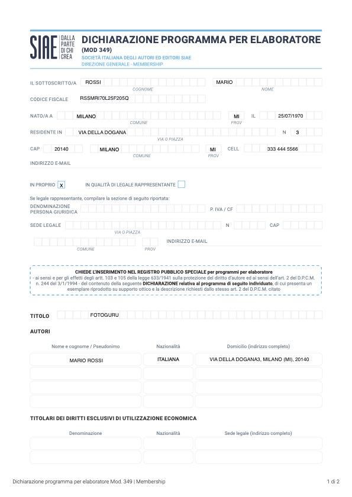
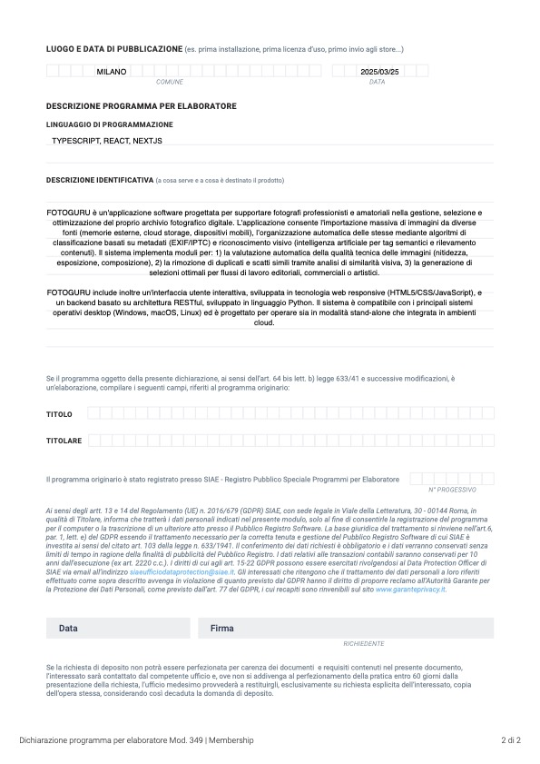

# Royalties software

Se voi soci avete sviluppato un software che viene utilizzato dalla vostra società per generare una parte o tutti i ricavi della società, allora potreste ricevere un reddito dalla vostra società che è tassato solo su base IRPEF (INPS non si applica) combinato con una vantaggiosa DEDUZIONE dell'imponibile IRPEF. In base alla tua età anagrafica e agli scaglioni IRPEF, le tasse da pagare si possono avvicinare al **15%** dell'importo percepito.  
Questo strumento ha quindi un'efficienza fino all'85% ovvero per ogni 100€ di costo all'impresa si ottengono fino a 85€ di royalties netti nei tuoi conti personali.

**Ecco come procedere**

1. **Deposito presso SIAE**\
   Il socio che ha sviluppato il software deve metterlo su un CD-ROM (si, quello di una volta) e consegnarlo alla SIAE nella richiesta di inserimento nel Pubblico Registro Software. \
   E' necessario compilare il modulo Mod. 349 e versare 126,62€ di costi amministrativi. 
   Trovate più informazioni presso il sito della SIAE: 
   [https://www.siae.it/it/cosa-facciamo/altri-servizi/pubblico-registro-software/](https://www.siae.it/it/cosa-facciamo/altri-servizi/pubblico-registro-software/)
   
   Attenzione **- La registrazione del software deve essere fatto dalla PERSONA FISICA e NON dalla società. Se sbagliate questo passaggio perde tutto il vantaggio.**

   Qui sotto trovi un esempio di compilazione del modulo Mod. 349:
   
   

2. **Contratto di licenza d'uso**\
   E' un contratto per cui la persona fisica, che ha sviluppato e registrato il software a suo nome, lo andrà a concedere in lincenza alla società, la quale potrà usarlo con un pagamento di un canone. Nel contratto deve essere indicato il numero di registro e data che avete ricevuto dalla SIAE. 
   
   **Attenzione** - Poichè si tratta di un contratto tra un socio e la sua stessa società è facile sovrastimare il valore. E' consigliato rimanere su un canone che sia non più del **3-5%** del fatturato annuale della società.  L'importo può essere fisso (es. 2000€/mese) e/o come percentuale del fatturato generato grazie al software. 
   
   Template contratto: [https://www.lexdo.it/modello/contratto-licenza-di-uso/](https://www.lexdo.it/modello/contratto-licenza-di-uso/)

3. **Pagamento**
   In base alle scadenze di pagamento che sono state pattuite dovrete emettere una notula con la quale effettuate il pagamento dalla società alla persona fisica. Il mese successivo verranno addebitate le imposte.

4. **Esempio**
   Considerando un depositario di software Under 35, si ha una deduzione del 40% dell'imponibile IRPEF. (Se over35, si parla del 25%).
   Consideriamo un costo azienda di 40000€
   L'imponibile IRPEF per il depositario è pertanto (1-0.4)*40000€ = 24000€
   L'IRPEF va pagato secondo una strategia di Acconto e Saldo.
   L'acconto è in carico alla società che versa per contro del depositario il 20% dell'imponibile: 24000€*0.2 = 4800€
   Il Saldo verrà pagato dal depositario in sede di dichiarazione dei redditi secondo le nomre consuete. Ai fini dell'esempio cosideriamo che il depositario non abbia nessun altro reddito pertanto ha un reddito totale di 24000€ e verrà applicata l'aliquota IRPEF del 23% (<28000€)
   Il totale IRPEF da pagare è quindi di 24000*0.23 = 5520€ di cui 4800€ già pagati tramite acconto dalla società e 5520€-4800€ = 720€ che il depositario dovrà pagare in sede di dichiarazione dei redditi.
   In totale pertanto il netto spendibile dal depositario sarà di 40000-5520€ = 34480€
   L'efficienza risulta quindi essere 34480€/40000€ = 86.2%

   [https://www.ilcommercialistaonline.it/royalties-e-diritto-dautore-qual-e-il-trattamento-fiscale/](https://www.ilcommercialistaonline.it/royalties-e-diritto-dautore-qual-e-il-trattamento-fiscale/)
   

